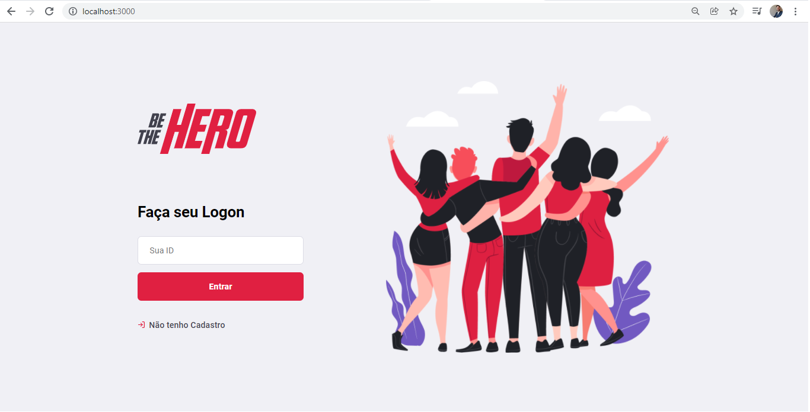
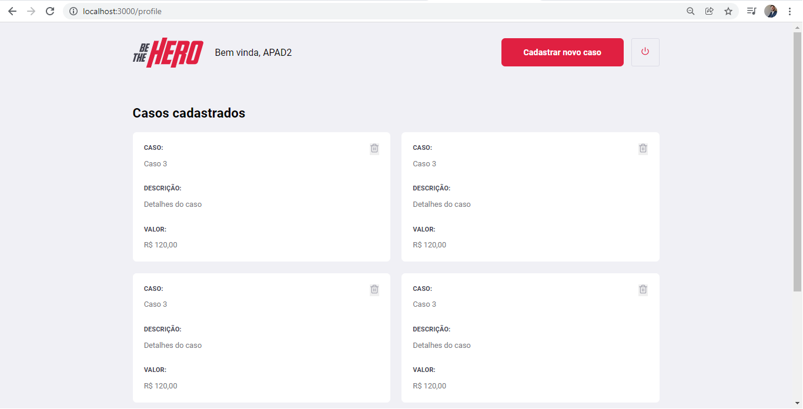
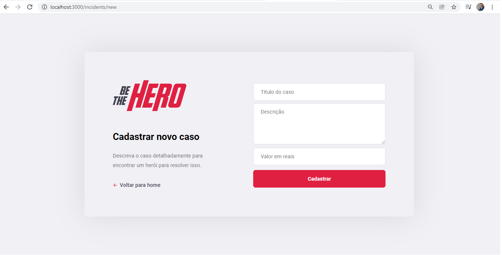
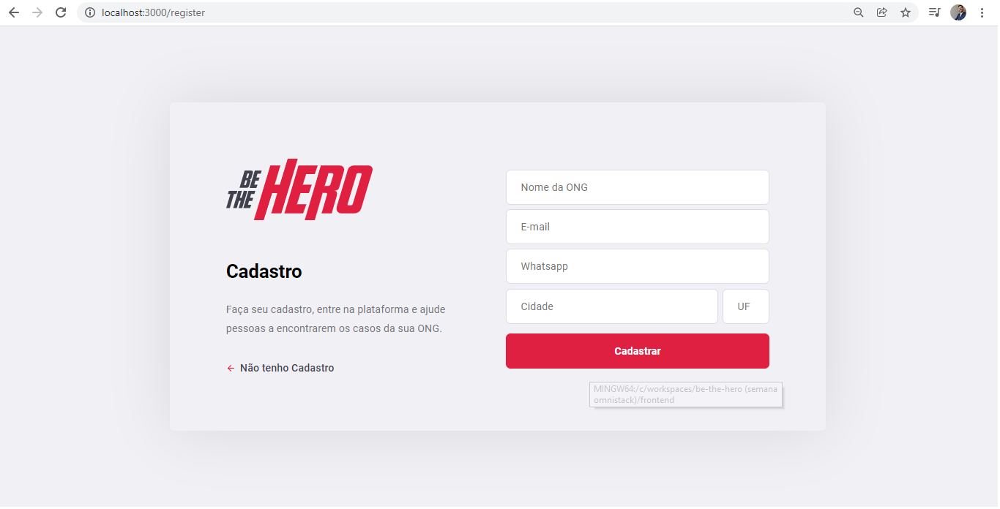

<div align="center">


# 

# Aplicação para conectar ONGS e outras instituições a pessoas com disponibilidade de ajudar.

## Criada com a stack <a href="https://pt-br.reactjs.org/">React</a>, <a href="https://nodejs.org/en/">Node</a> e <a href="https://www.sqlite.org/index.html">SQlite</a>. 


#

</div>

### Esse projeto foi criado durando a 11ª edição da Semana Omnistack promovida pela <a href="https://www.rocketseat.com.br/">Rocketseat.</a>

# Para rodar a aplicação

### Instalação das dependências
```bash
1º Antes de rodar o projeto, devemos instalar as dependências. Para isso, utilize o comando "npm install" na pasta back end, depois faça o mesmo na pasta front end. 
```

### Execução do Projeto
```bash
2º Execute o comando "npm start" na pasta backend e depois faça o mesmo na pasta front end. 
```

## Telas da aplicação






<hr />

## Autor

Jean Pereira da Cruz

Contato: <a href="https://www.linkedin.com/in/jean-pereira-cruz/">Linkedin</a>

